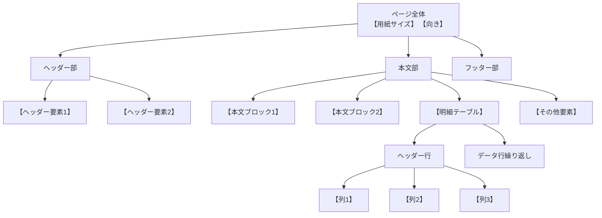

# 【帳票名】設計書

## 概要

| 項目 | 内容 |
|:-----|:-----|
| 帳票ID | 【帳票ID】 |
| 帳票名 | 【帳票名（日本語）】 |
| ファイル名 | 【ファイル名.rdlx】 |
| フォーマット | ActiveReports.NET 18 |
| 用紙サイズ | 【A4 / A3 / B5 など】 |
| 向き | 【縦（Portrait） / 横（Landscape）】 |
| データソース | 【DataSet名】 |
| 作成日 | 【YYYY-MM-DD】 |
| バージョン | 【x.x】 |
| 備考 | 【用途・目的など】 |

---

## レイアウト構成図



---

## コントロール配置表

### ヘッダー部

| ID | コントロール | 名前 | 位置(Top, Left) | サイズ(Width, Height) | 値 | スタイル |
|---:|:------------|:-----|:----------------|:---------------------|:---|:---------|
| 1 | 【TextBox/Image/Line】 | 【コントロール名】 | 【X】cm, 【Y】cm | 【W】cm, 【H】cm | 【値/式】 | 【スタイル詳細】 |

### 本文部 - 【セクション名1】

| ID | コントロール | 名前 | 位置(Top, Left) | サイズ(Width, Height) | 値 | スタイル |
|---:|:------------|:-----|:----------------|:---------------------|:---|:---------|
| 2 | 【TextBox/Image/Line】 | 【コントロール名】 | 【X】cm, 【Y】cm | 【W】cm, 【H】cm | 【値/式】 | 【スタイル詳細】 |

### 本文部 - 【セクション名2】

| ID | コントロール | 名前 | 位置(Top, Left) | サイズ(Width, Height) | 値 | スタイル |
|---:|:------------|:-----|:----------------|:---------------------|:---|:---------|
| 3 | 【TextBox/Image/Line】 | 【コントロール名】 | 【X】cm, 【Y】cm | 【W】cm, 【H】cm | 【値/式】 | 【スタイル詳細】 |

### 本文部 - 明細テーブル

| ID | コントロール | 名前 | 位置(Top, Left) | サイズ(Width, Height) | データソース |
|---:|:------------|:-----|:----------------|:---------------------|:------------|
| 【N】 | Table | 【テーブル名】 | 【X】cm, 【Y】cm | 【W】cm, 【H】cm | 【DataSet名】 |

### フッター部

| ID | コントロール | 名前 | 位置(Top, Left) | サイズ(Width, Height) | 値 | スタイル |
|---:|:------------|:-----|:----------------|:---------------------|:---|:---------|
| 【N】 | 【TextBox/Image/Line】 | 【コントロール名】 | 【X】cm, 【Y】cm | 【W】cm, 【H】cm | 【値/式】 | 【スタイル詳細】 |

---

## 明細テーブル列定義

### ヘッダー行

| 列No | コントロール名 | ヘッダー表示 | 幅 | スタイル |
|-----:|:--------------|:------------|---:|:---------|
| 1 | 【TextBox名】 | 【表示文字列】 | 【幅】 | 【スタイル】 |
| 2 | 【TextBox名】 | 【表示文字列】 | 【幅】 | 【スタイル】 |

### データ行

| 列No | コントロール名 | フィールド | 表示式 | 形式 | 配置 | スタイル |
|-----:|:--------------|:----------|:-------|:-----|:-----|:---------|
| 1 | 【TextBox名】 | 【Field名】 | 【式】 | 【形式】 | 【左/右/中央】 | 【スタイル】 |
| 2 | 【TextBox名】 | 【Field名】 | 【式】 | 【形式】 | 【左/右/中央】 | 【スタイル】 |

**背景色ロジック（例）:**
```
=IIF((RowNumber() Mod 2), "Transparent","#E6E2DD")
```
【ロジックの説明】

---

## データ項目定義

| 項目ID | 項目名（日本語） | 項目名（英語） | データ型 | 桁数 | 必須 | 形式 | 備考 |
|:-------|:----------------|:--------------|:---------|-----:|:----:|:-----|:-----|
| 1 | 【日本語名】 | 【FieldName】 | 【string/int/decimal/datetime】 | 【桁数】 | ○/× | 【表示形式】 | 【備考】 |
| 2 | 【日本語名】 | 【FieldName】 | 【string/int/decimal/datetime】 | 【桁数】 | ○/× | 【表示形式】 | 【備考】 |

---

## 計算式定義

| 計算項目 | 式 | 適用範囲 | 説明 |
|:---------|:---|:---------|:-----|
| 【項目名】 | 【式】 | 【スコープ】 | 【説明】 |
| 【項目名】 | 【式】 | 【スコープ】 | 【説明】 |

---

## カラーパレット

| 用途 | カラーコード | 色名 | 使用箇所 |
|:-----|:------------|:-----|:---------|
| プライマリ | 【#XXXXXX】 | 【色名】 | 【使用箇所】 |
| セカンダリ | 【#XXXXXX】 | 【色名】 | 【使用箇所】 |
| テキスト（濃） | 【#XXXXXX】 | 【色名】 | 【使用箇所】 |
| テキスト（淡） | 【#XXXXXX】 | 【色名】 | 【使用箇所】 |
| 背景 | 【#XXXXXX】 | 【色名】 | 【使用箇所】 |

---

## フォント定義

| 用途 | フォントファミリー | サイズ | 太さ | 使用箇所 |
|:-----|:------------------|:------|:-----|:---------|
| タイトル | 【フォント名】 | 【XX】pt | 【太さ】 | 【使用箇所】 |
| 大見出し | 【フォント名】 | 【XX】pt | 【太さ】 | 【使用箇所】 |
| 中見出し | 【フォント名】 | 【XX】pt | 【太さ】 | 【使用箇所】 |
| 本文 | 【フォント名】 | 【XX】pt | 【太さ】 | 【使用箇所】 |
| テーブル | 【フォント名】 | 【XX】pt | 【太さ】 | 【使用箇所】 |

---

## データフロー図

```mermaid
flowchart LR
    DS[(【DataSet名】)] --> F1[【Field1】]
    DS --> F2[【Field2】]
    DS --> F3[【明細データ】]

    F1 --> TXT1[【表示コントロール1】]
    F2 --> TXT2[【表示コントロール2】]

    F3 --> T1[【列1】]
    F3 --> T2[【列2】]

    T1 --> CALC1[【計算式】]
    T2 --> CALC1
    CALC1 --> RESULT[【結果表示】]

    style DS fill:【カラーコード】,color:【テキストカラー】
    style CALC1 fill:【カラーコード】
    style RESULT fill:【カラーコード】
```

---

## ワイヤーフレーム（モックアップ）

```mermaid
graph TB
    subgraph Page["【用紙サイズ】 (【幅】cm × 【高さ】cm)"]
        subgraph H["■ ヘッダー部 (【開始】-【終了】cm)"]
            T1["【タイトル要素】<br/>【スタイル詳細】"]
        end

        subgraph B["■ 本文部 (【開始】-【終了】cm)"]
            direction TB
            C1["【要素1】"]
            C2["【要素2】"]

            subgraph TBL["▼ 明細テーブル"]
                TH["【ヘッダー行内容】"]
                TR1["【データ行1】"]
                TR2["【データ行2】"]
            end

            C3["【要素3】"]
        end

        subgraph F["■ フッター部"]
            F1["【フッター要素】"]
        end
    end

    T1 --> C1
    C1 --> C2
    C2 --> TBL
    TBL --> C3
    C3 --> F1

    style H fill:【カラー】,stroke:【カラー】
    style T1 fill:【カラー】,color:【カラー】
    style TH fill:【カラー】,color:【カラー】
    style Page fill:#fff,stroke:#333,stroke-width:2px
```

### レイアウト詳細図（ボックスモデル）

```mermaid
block-beta
    columns 【列数】
    block:header:【幅】
        h1["【ヘッダー内容】"]
    end
    space:【幅】
    block:section1:【幅】
        s1["【セクション1内容】"]
    end
    block:section2:【幅】
        s2["【セクション2内容】"]
    end
    block:table:【幅】
        t1["【テーブル内容】"]
    end

    style header fill:【カラー】,color:【カラー】
    style section1 fill:【カラー】
    style table fill:【カラー】,stroke:【カラー】
```

---

## 備考・注意事項

### データ要件
- 【データソース要件1】
- 【データソース要件2】
- 【null値の扱い】

### レイアウト制約
- 【用紙サイズ制約】
- 【明細行の扱い】
- 【ページ分割ルール】

### スタイルガイドライン
- 【カラーテーマ】
- 【罫線の扱い】
- 【余白の設定】

### 印刷設定
- 【余白設定】
- 【ヘッダー/フッター設定】
- 【その他印刷オプション】

### 今後の拡張
- [ ] 【拡張項目1】
- [ ] 【拡張項目2】
- [ ] 【拡張項目3】

---

## バージョン履歴

| バージョン | 日付 | 変更内容 | 作成者 |
|:----------|:-----|:---------|:-------|
| 1.0 | 【YYYY-MM-DD】 | 初版作成 | 【作成者名】 |
| 1.1 | 【YYYY-MM-DD】 | 【変更内容】 | 【作成者名】 |

---

## 参照ファイル

- レポート定義: [`【ファイル名.rdlx】`](./【ファイル名.rdlx】)
- モックアップ: [`【ファイル名.excalidraw】`](./【ファイル名.excalidraw】)
- サンプルデータ: [`【ファイル名.json/.xml】`](./【ファイル名】)
